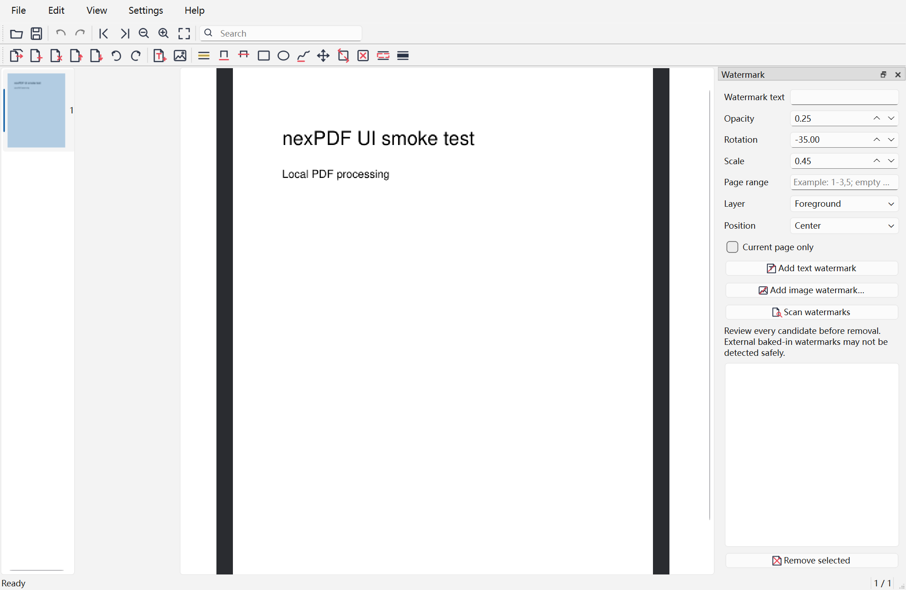

# nexPDF

[中文](#中文) · [English](#english)

## 中文

nexPDF 是一个本地运行、跨平台的 PDF 查看与实用编辑工具，使用 C++20、Qt Widgets 和 MuPDF 构建。它不包含遥测，不上传文档，也不会自动执行 PDF JavaScript、启动嵌入文件或静默打开外部链接。

> 项目状态：`v1.0.0` 开发中。源码接口和文件格式约定在 v1 前可能变化。只有通过发布检查表的标签才会被标记为正式 Release。

### 功能

- 查看：拖放和命令行打开、密码输入、连续滚动、页码导航、缩放、旋转和文本搜索。
- 加密：AES-256（默认）和 AES-128 兼容模式，可配置用户/所有者密码及 PDF 权限。
- 解密：仅使用正确密码创建无加密副本；不包含破解、爆破或权限绕过功能。
- 编辑：空白页、删除、排序、旋转、导入页面；添加、移动、缩放、删除工具创建的文字和图片；高亮、下划线、删除线、自由文本、图形、手绘批注。
- 涂黑：先创建预览批注，再由用户确认永久应用。应用后重叠内容会被实际移除，不只是画黑框。
- 水印：文字或图片水印；精确识别本工具创建的水印；列出外部 Watermark 批注候选并要求逐项确认。
- 安全保存：写入目标目录临时文件，由 MuPDF 重新打开校验后再原子替换；默认另存为；已签名 PDF 强制保存到新文件。
- 双语：跟随系统语言，并可在应用中切换简体中文/英文。
- 界面：高频查看和编辑操作使用一致的矢量风格图标、键盘快捷键与中英文 Tooltip；应用图标覆盖 Windows、Linux 和 macOS 包。

PDF 权限主要依赖阅读器遵守，不能替代真正的数据访问控制。外部 PDF 可能把水印烘焙进正文、图片或共享 XObject；nexPDF 不保证识别所有此类水印，也不会自动删除启发式候选。请仅处理您拥有权利或已获得授权的文件，并始终保留备份。

### 界面



截图由 Windows 11、150% DPI 的自动化 UI 冒烟测试生成：真实主窗口打开合成 PDF，等待主画布完成渲染后抓取。中文字体、输入法和其他平台外观仍需按发布检查表人工验收。

### 构建

依赖版本固定为 Qt 6.11.2 和 MuPDF 1.28.2。获取源码时必须包含子模块：

```powershell
git clone --recurse-submodules https://github.com/YDLuo-1/nexPDF.git
cd nexPDF
```

Windows 的精简 MuPDF 构建会排除 OCR、curl、OpenGL 查看器、Office 导出和条码组件：

```powershell
powershell -ExecutionPolicy Bypass -File tools/Build-MuPDFWindows.ps1 -Configuration Release
cmake -S . -B build/windows -G "Visual Studio 17 2022" -A x64 `
  -DCMAKE_PREFIX_PATH=C:\Qt\6.11.2\msvc2022_64 `
  -DMUPDF_ROOT="$PWD\out\mupdf-windows-x64"
cmake --build build/windows --config Release --parallel
ctest --test-dir build/windows -C Release --output-on-failure
```

Linux/macOS 以及打包步骤见 [构建说明](docs/building.md)。架构与线程/保存约束见 [架构说明](docs/architecture.md)，引擎选型和同类项目对比见 [技术调研](docs/research.md)，运行库与许可边界见 [依赖清单](docs/dependencies.md)。

### 已验证范围

- 已在 Windows x64 使用 MSVC 19.44、真实 MuPDF 1.28.2 静态库和本地 Qt 6.10.2 完成 Release 链接；应用、测试和基准目标均已生成。
- 本地 8 组核心功能用例已覆盖打开、渲染、搜索、选区取文、Unicode 密码 AES-256 加密/解密、空用户密码 AES-128 与权限、页面插入/旋转、文字/图片/墨迹/高亮批注、两阶段永久涂黑、对象两阶段调整、撤销/重做、跨 display-list LRU 淘汰的多页渲染、标准 Watermark 批注的候选确认移除，以及 nexPDF 水印添加、扫描、精确移除和渲染等价；Qt Test 总计 10 项（含初始化/清理）全部通过。
- 独立 UI 冒烟在 Windows 11、150% DPI 下实例化真实主窗口、打开 PDF、等待主画布瓦片完成，并验证页面未被缩略图结果污染；Qt Test 3 项（含初始化/清理）通过。
- qpdf 12.4.0 已对解密、编辑、永久涂黑和水印测试输出完成 6 项独立结构检查，并确认 AES-256 使用 R=6/AESv3、AES-128 使用 AESv2 且权限限制生效；Poppler 26.02.0-0 成功渲染编辑与涂黑结果，且原始和去水印文件的参考渲染完全一致。
- 本地 Qt 6.10.2 Windows 便携验证 ZIP（r6）实测 41.474 MiB，解压后依赖检查和隐藏式 `--version` 冒烟通过；最终用户包不含测试基准程序或 `Qt6Test.dll`。该文件不是正式 Release 资产。
- Qt 6.11.2 在线包在当前镜像索引中不可直接安装；本地编译检查使用兼容的 Qt 6.10.2，正式发布仍锁定 6.11.2。
- 上述证据仅是 Windows 本地验证，不代表发布检查表已经完成。Qt 6.11.2 三平台构建、复杂语料、完整编辑矩阵、真实 100/300/1000 页性能对比、干净虚拟机和界面截图仍须由 Release CI/人工验收完成。

### 许可与免责声明

项目采用 [`AGPL-3.0-or-later`](LICENSE)。AGPL 允许复制、修改和商用，但分发修改版本或通过网络提供修改版本功能时，通常需要向相应用户提供对应源码。它不能阻止他人依法复制代码。第三方组件见 [THIRD_PARTY_NOTICES.md](THIRD_PARTY_NOTICES.md)。

**AI 开发免责声明：** 本项目大量使用 AI 辅助设计、编码和审查。虽然建议所有变更经过人工审查和自动化测试，软件仍可能包含功能缺陷、安全问题或导致数据损坏的错误。本软件按原样提供、不附带任何担保。请保留原始文件备份，并用独立工具验证重要输出。

nexPDF 与任何其他同名或近似名称的 NexPDF 产品、公司或网站均无关联。

## English

nexPDF is a local, cross-platform PDF viewer and practical editor built with C++20, Qt Widgets, and MuPDF. It contains no telemetry, uploads no documents, and does not automatically execute PDF JavaScript, launch embedded files, or silently open external links.

> Project status: `v1.0.0` is under development. Source interfaces and file conventions may change before v1. Only tags that pass the release checklist are published as formal releases.

### Features

- Viewing: drag-and-drop and command-line opening, password prompt, continuous scrolling, page navigation, zoom, rotation, and text search.
- Encryption: AES-256 by default, with AES-128 compatibility mode, user/owner passwords, and PDF permission flags.
- Decryption: creates an unencrypted copy only with a correct password; no cracking, brute force, or permission bypass.
- Editing: insert blank pages, delete, reorder, rotate, and import pages; add, move, resize, and remove tool-created text/images; highlights, underlines, strikeouts, free text, shapes, and ink annotations.
- Redaction: create preview annotations first, then explicitly apply permanent redaction. Applying redaction removes overlapping content rather than drawing a cosmetic black box.
- Watermarks: text/image watermarks, exact recognition of nexPDF-created marks, and reviewed candidates for external Watermark annotations.
- Safe saving: write a sibling temporary file, reopen it with MuPDF, then atomically replace the destination; Save As is the default, and signed PDFs must be saved to a new path.
- Bilingual UI: follows the system language and can switch between Simplified Chinese and English.
- Interface: common viewing/editing actions use a consistent vector-style icon set, keyboard shortcuts, and bilingual tooltips; app icons are wired into Windows, Linux, and macOS packages.

PDF permissions depend mainly on reader cooperation and are not a substitute for access control. External PDFs may bake watermarks into page content, images, or shared XObjects. nexPDF cannot promise to detect all such marks and never auto-deletes heuristic candidates. Process only files you own or are authorized to modify, and always keep backups.

### Interface


The screenshot is generated by the automated Windows 11 UI smoke at 150% DPI after a real main window opens and renders a synthetic PDF. Chinese fonts/IME and appearance on the other platforms remain manual release-checklist gates.

### Build

Dependencies are pinned to Qt 6.11.2 and MuPDF 1.28.2. Clone with submodules:

```powershell
git clone --recurse-submodules https://github.com/YDLuo-1/nexPDF.git
cd nexPDF
```

The slim Windows MuPDF build excludes OCR, curl, the OpenGL viewer, Office export, and barcode components:

```powershell
powershell -ExecutionPolicy Bypass -File tools/Build-MuPDFWindows.ps1 -Configuration Release
cmake -S . -B build/windows -G "Visual Studio 17 2022" -A x64 `
  -DCMAKE_PREFIX_PATH=C:\Qt\6.11.2\msvc2022_64 `
  -DMUPDF_ROOT="$PWD\out\mupdf-windows-x64"
cmake --build build/windows --config Release --parallel
ctest --test-dir build/windows -C Release --output-on-failure
```

See [build documentation](docs/building.md) for Linux/macOS and packaging, [architecture](docs/architecture.md) for threading, ownership, and safe-save rules, [technical research](docs/research.md) for the engine decision and project comparison, and the [dependency inventory](docs/dependencies.md) for runtime and license boundaries.

### Verified scope

- Windows x64 Release binaries for the application, tests, and benchmark have been linked with MSVC 19.44, real MuPDF 1.28.2 static libraries, and the locally available Qt 6.10.2.
- Eight local core test groups cover open/render/search/selection, AES-256 encryption and decryption with a Unicode password, AES-128 with an empty user password and restricted permissions, page insertion/rotation, text/image/ink/highlight annotations, two-stage permanent redaction, two-stage object adjustment, undo/redo, multi-page rendering across display-list LRU eviction, confirmed removal of a standard Watermark annotation, and nexPDF watermark add/scan/exact removal/render equivalence. Qt Test reports ten passing items including initialization and cleanup.
- A separate Windows 11 UI smoke at 150% DPI instantiates the real main window, opens a PDF, waits for the main canvas tile, and verifies that thumbnail results cannot shrink the page. Its three Qt Test items, including initialization and cleanup, pass.
- qpdf 12.4.0 independently accepted six decrypted, edited, permanently redacted, and watermarked outputs; it reported R=6/AESv3 for AES-256 and AESv2 with effective permission restrictions for AES-128. Poppler 26.02.0-0 rendered edited/redacted outputs and produced identical reference renders for the original and watermark-restored files.
- A local Qt 6.10.2 Windows portable validation ZIP (r6) measured 41.474 MiB and passed extracted dependency and hidden `--version` smoke checks. The end-user package contains neither the benchmark executable nor `Qt6Test.dll`; it is not a formal Release asset.
- Qt 6.11.2 could not be installed from the current online mirror index; compatible Qt 6.10.2 was used for the local compile check. Formal releases remain pinned to 6.11.2.
- This is Windows-local evidence, not completion of the release checklist. Exact-Qt three-platform builds, complex corpora, the complete editing matrix, real 100/300/1000-page performance comparisons, clean-VM checks, and UI screenshots still require Release CI and human acceptance.

### License and disclaimer

Licensed under [`AGPL-3.0-or-later`](LICENSE). The AGPL permits copying, modification, and commercial use, but distributing modified versions or offering modified network functionality generally requires providing corresponding source to the relevant users. It does not prevent lawful copying. See [third-party notices](THIRD_PARTY_NOTICES.md).

**AI development disclaimer:** This project makes extensive use of AI-assisted design, coding, and review. Although changes should receive human review and automated testing, the software may still contain defects, security issues, or data-loss bugs. It is provided as-is, without warranty. Keep original backups and independently validate important output.

nexPDF is not affiliated with any other product, company, or website using NexPDF or a similar name.
